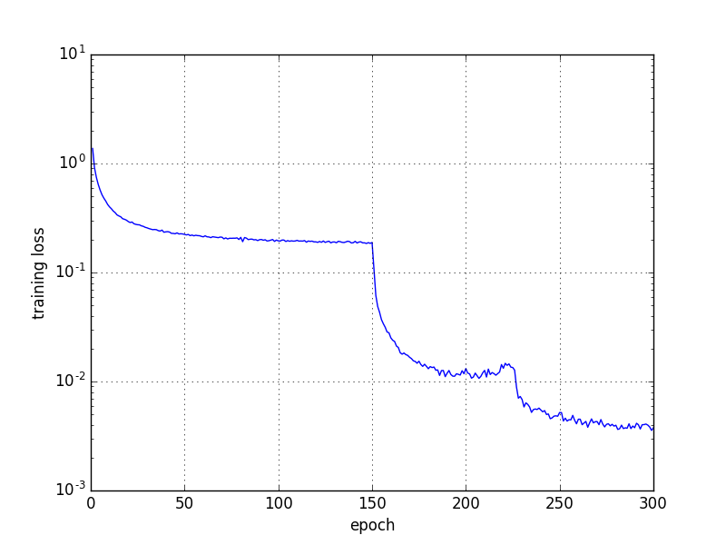
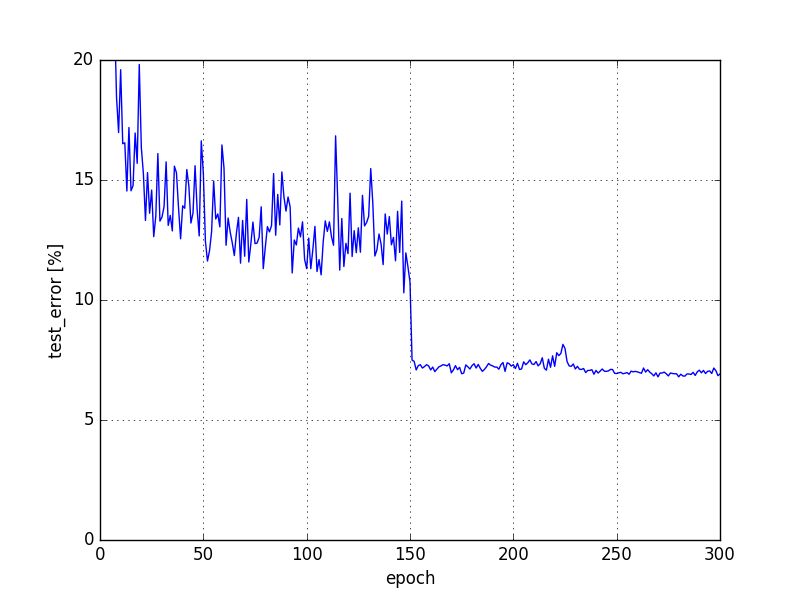

===================================================
Densely Connected Convolutional Networks by Chainer
===================================================

This is an experimental implementation of `Densely Connected Convolutional Networks <https://arxiv.org/abs/1608.06993>`_ using Chainer framework.

- Original paper: https://arxiv.org/abs/1608.06993
- Official implementation: https://github.com/liuzhuang13/DenseNet

Requirements
============

- `Chainer <http://chainer.org>`_  2.0+
- `CuPy <https://cupy.chainer.org>`_ 1.0+

Usage
=====

Train a DenseNet on CIFAR-10 dataset using::

   python code/train.py --gpu 0 -o result

Visualize training result using::

   python code/visualize.py result/log -o result

Sample Result
=============

- Model parameters: L = 40, k = 12
- Batch size: 64
- Dataset: C10 (CIFAR-10 dataset without data augmentation)

